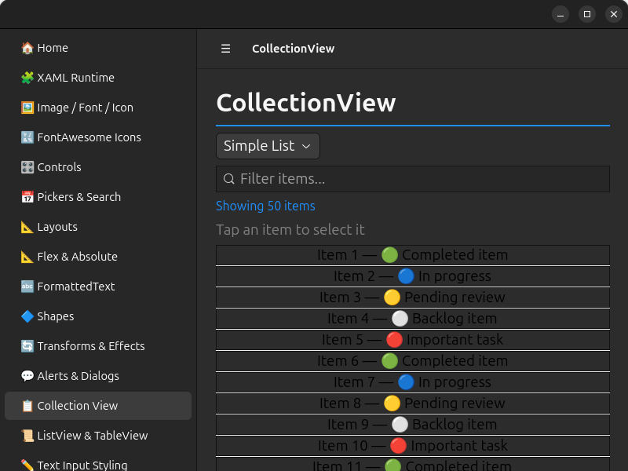
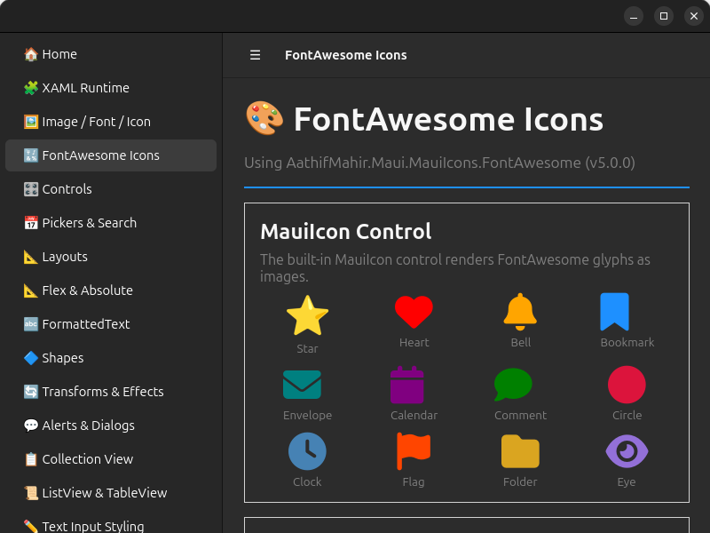
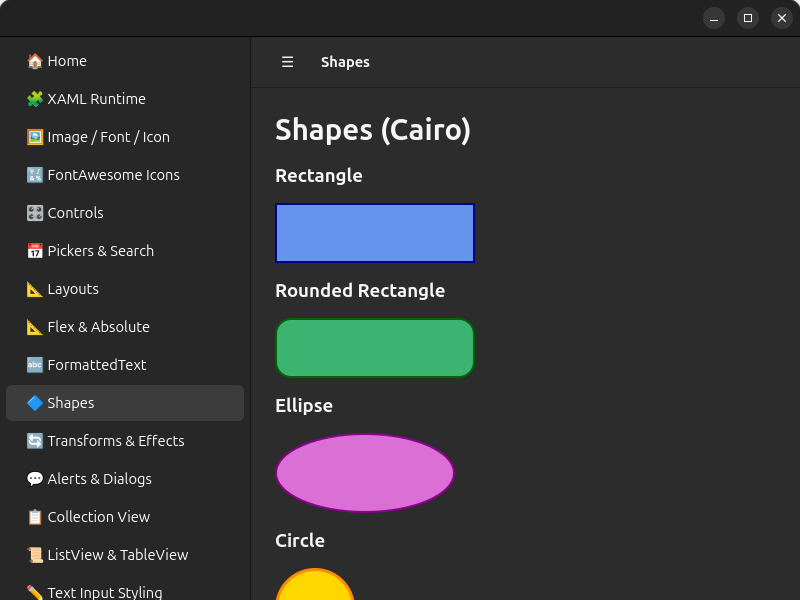
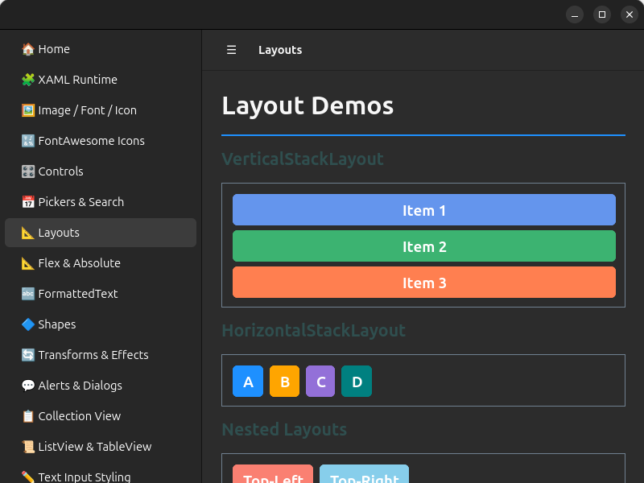
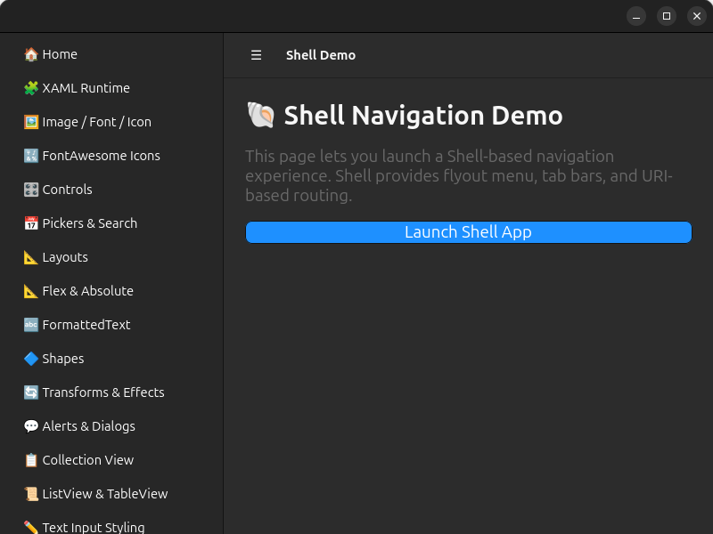
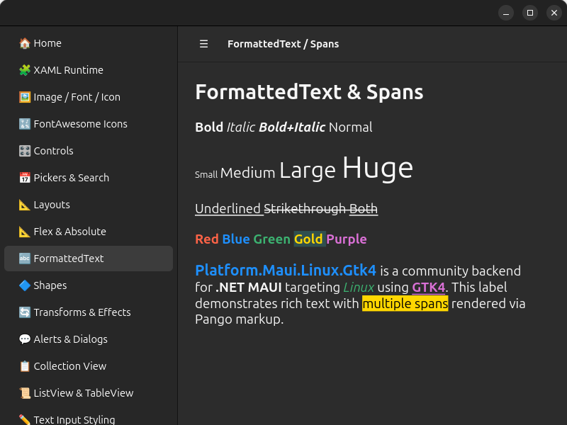
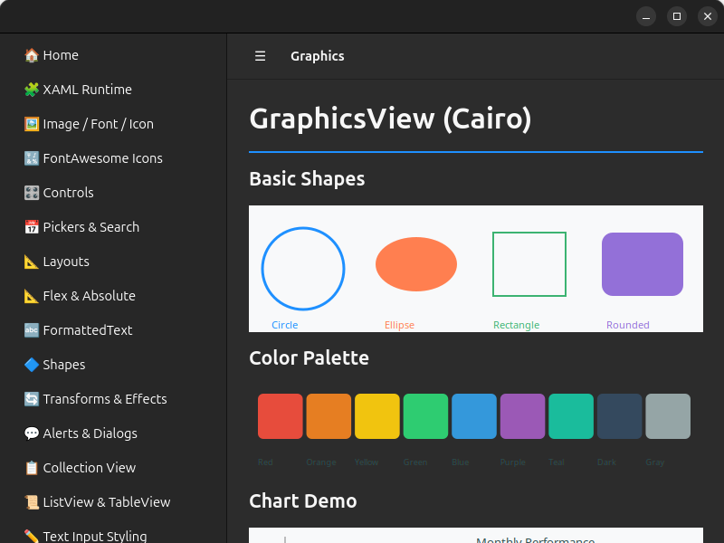

# Platform.Maui.Linux.Gtk4

A community-driven .NET MAUI backend for Linux, powered by **GTK4**. Run your .NET MAUI applications natively on Linux desktops with GTK4 rendering via [GirCore](https://github.com/gircore/gir.core) bindings.

> **Status:** Early / experimental — contributions and feedback are welcome!

https://github.com/user-attachments/assets/039f1695-3cd0-4b0b-ad11-dce304d0cdce

## Screenshots

<table>
<tr>
<td><br/><b>Home & Sidebar Navigation</b></td>
<td><br/><b>Interactive Controls</b></td>
</tr>
<tr>
<td><br/><b>CollectionView (Virtualized)</b></td>
<td><br/><b>FontAwesome Icons</b></td>
</tr>
<tr>
<td><br/><b>Shapes & Graphics</b></td>
<td><br/><b>Layouts</b></td>
</tr>
<tr>
<td><br/><b>ControlTemplate & ContentPresenter</b></td>
<td><br/><b>Pickers & Search</b></td>
</tr>
<tr>
<td><br/><b>FormattedText & Spans</b></td>
<td><br/><b>Transforms & Effects</b></td>
</tr>
<tr>
<td colspan="2"><br/><b>GraphicsView (Cairo)</b></td>
</tr>
</table>

## Features

- **Native GTK4 rendering** — MAUI controls map to real GTK4 widgets (~95% handler coverage).
- **Blazor Hybrid support** — Host Blazor components inside a native GTK window using WebKitGTK.
- **All basic controls** — Label, Button, Entry, Editor, CheckBox, Switch, Slider, Stepper, ProgressBar, ActivityIndicator, Image, ImageButton, BoxView, RadioButton.
- **Input & selection** — Picker, DatePicker, TimePicker, SearchBar.
- **Collection controls** — CollectionView (virtualized via GTK4 `Gtk.ListView`), ListView, TableView, CarouselView, SwipeView, RefreshView, IndicatorView.
- **Layout support** — StackLayout, Grid, FlexLayout, AbsoluteLayout, ScrollView, ContentView, Border, Frame.
- **Navigation** — NavigationPage, TabbedPage, FlyoutPage, Shell (flyout, tabs, route navigation).
- **Alerts & Dialogs** — DisplayAlert, DisplayActionSheet, DisplayPromptAsync via native GTK4 windows.
- **Gestures** — Tap, Pan, Swipe, Pinch, Pointer gesture recognizers.
- **Graphics & Shapes** — GraphicsView via Cairo, all shape types (Rectangle, Ellipse, Line, Path, Polygon, Polyline).
- **Font icons** — FontImageSource rendering via Cairo/Pango, embedded font registration with FontAwesome support.
- **Animations** — TranslateTo, FadeTo, ScaleTo, RotateTo via `GtkPlatformTicker` + Gsk.Transform.
- **ControlTemplate** — Full ContentPresenter and TemplatedView support.
- **VisualStateManager** — Normal, PointerOver, Pressed, Disabled, Focused states.
- **Transforms** — TranslationX/Y, Rotation, Scale via Gsk.Transform; Shadow, Clip, ZIndex.
- **Essentials** — Clipboard, Preferences, DeviceInfo, AppInfo, Battery, Connectivity, FilePicker, and more.
- **Cairo-based graphics** — `GraphicsView` draws via the Microsoft.Maui.Graphics Cairo backend.
- **Theming** — Automatic light/dark theme detection through `GtkThemeManager`.

## Prerequisites

| Requirement | Version |
|---|---|
| .NET SDK | 10.0+ |
| GTK 4 libraries | 4.x (system package) |
| WebKitGTK *(Blazor only)* | 6.x (system package) |

### Install GTK4 & WebKitGTK (Debian / Ubuntu)

```bash
sudo apt install libgtk-4-dev libwebkitgtk-6.0-dev
```

### Install GTK4 & WebKitGTK (Fedora)

```bash
sudo dnf install gtk4-devel webkitgtk6.0-devel
```

## Quick Start

### Option 1: Use the template (recommended)

```bash
# Install the template
dotnet new install Platform.Maui.Linux.Gtk4.Templates

# Create a new Linux MAUI app
dotnet new maui-linux-gtk4 -n MyApp.Linux
cd MyApp.Linux
dotnet run
```

### Option 2: Add to an existing project manually

Add the NuGet package:

```bash
dotnet add package Platform.Maui.Linux.Gtk4 --prerelease
dotnet add package Platform.Maui.Linux.Gtk4.Essentials --prerelease   # optional
```

Then set up your entry point:

**Program.cs**

```csharp
using Platform.Maui.Linux.Gtk4.Platform;
using Microsoft.Maui.Hosting;

public class Program : GtkMauiApplication
{
    protected override MauiApp CreateMauiApp() => MauiProgram.CreateMauiApp();

    public static void Main(string[] args)
    {
        var app = new Program();
        app.Run(args);
    }
}
```

**MauiProgram.cs**

```csharp
using Platform.Maui.Linux.Gtk4.Hosting;
using Microsoft.Maui.Hosting;

public static class MauiProgram
{
    public static MauiApp CreateMauiApp()
    {
        var builder = MauiApp
            .CreateBuilder()
            .UseMauiAppLinuxGtk4<App>();

        return builder.Build();
    }
}
```

## XAML Support

`Platform.Maui.Linux.Gtk4` relies on MAUI's normal transitive build assets for XAML.
In Linux head projects, `*.xaml` files are still collected as `MauiXaml` and compiled by MAUI's XAML build pipeline without extra package-specific overrides.

## Resource Item Support

Linux head projects can use MAUI resource item groups for common `Resources/*` paths:

- `MauiImage` from `Resources/Images/**`
- `MauiFont` from `Resources/Fonts/**`
- `MauiAsset` from `Resources/Raw/**` (with `LogicalName` defaulting to `%(RecursiveDir)%(Filename)%(Extension)`)
- `MauiIcon` from explicit items, or default `Resources/AppIcon/appicon.{svg|png|ico}`

These are copied into build/publish output so image/file lookups can resolve at runtime.
When `MauiIcon` is present, Linux builds emit `hicolor` icon-theme files in output and runtime sets the GTK window default icon name from that icon.

## Adding Linux to a Multi-Targeted MAUI App

Since there is no official `-linux` TFM (Target Framework Moniker) from Microsoft, MAUI projects can't conditionally include the Linux backend via `TargetFrameworks` the way they do for Android/iOS/Windows. Instead, use the **"Linux head project"** pattern:

```
MyApp/                              ← Your existing multi-targeted MAUI project
├── MyApp.csproj                       (net10.0-android;net10.0-ios;...)
├── App.cs
├── MainPage.xaml
├── ViewModels/
├── Services/
└── Platforms/
    ├── Android/
    ├── iOS/
    └── ...

MyApp.Linux/                        ← New Linux-specific project
├── MyApp.Linux.csproj                 (net10.0, references Platform.Maui.Linux.Gtk4)
├── Program.cs                         (GtkMauiApplication entry point)
└── MauiProgram.cs                     (builder.UseMauiAppLinuxGtk4<App>())
```

### Setup

1. **Create the Linux head project** next to your MAUI project:

```bash
dotnet new maui-linux-gtk4 -n MyApp.Linux
```

2. **Reference your shared code** — add a project reference from `MyApp.Linux.csproj` to your MAUI project (or a shared class library):

```xml
<!-- MyApp.Linux.csproj -->
<ItemGroup>
  <ProjectReference Include="../MyApp/MyApp.csproj" />
</ItemGroup>
```

3. **Run on Linux:**

```bash
dotnet run --project MyApp.Linux
```

### Why a separate project?

The platform-specific TFMs (`net10.0-android`, `net10.0-ios`, etc.) are powered by .NET workloads that Microsoft ships. Creating a custom `net10.0-linux` TFM would require building and distributing a full .NET workload — complex infrastructure that's unnecessary for most use cases.

The separate project approach is the same pattern used by [OpenMaui](https://github.com/open-maui/maui-linux-gtk4) and [MauiAvalonia](https://github.com/wieslawsoltes/MauiAvalonia). It works with standard `dotnet build`/`dotnet run`, is NuGet-distributable, and keeps your existing MAUI project unchanged.

## Building from Source

```bash
git clone https://github.com/Redth/Platform.Maui.Linux.Gtk4.git
cd Platform.Maui.Linux.Gtk4
dotnet restore
dotnet build
```

### Run the sample app

```bash
# Sample app (includes native controls, Blazor Hybrid, essentials, and more)
dotnet run --project samples/Platform.Maui.Linux.Gtk4.Sample
```

## Project Structure

```
Platform.Maui.Linux.Gtk4.slnx                          # Solution file
├── src/
│   ├── Platform.Maui.Linux.Gtk4/                       # Core MAUI backend
│   │   ├── Handlers/                     # GTK4 handler implementations
│   │   ├── Hosting/                      # AppHostBuilderExtensions (UseMauiAppLinuxGtk4)
│   │   └── Platform/                     # GTK application, context, layout, theming
│   ├── Platform.Maui.Linux.Gtk4.Essentials/            # MAUI Essentials for Linux (clipboard, etc.)
│   └── Platform.Maui.Linux.Gtk4.BlazorWebView/         # BlazorWebView support via WebKitGTK
├── samples/
│   └── Platform.Maui.Linux.Gtk4.Sample/                # Sample app (controls, Blazor, essentials)
├── templates/                            # dotnet new templates
└── docs/                                 # Documentation
```

## NuGet Packages

| Package | Purpose |
|---|---|
| `Platform.Maui.Linux.Gtk4` | Core GTK4 backend — handlers, hosting, platform services |
| `Platform.Maui.Linux.Gtk4.Essentials` | MAUI Essentials (clipboard, preferences, device info, etc.) |
| `Platform.Maui.Linux.Gtk4.BlazorWebView` | Blazor Hybrid support via WebKitGTK |
| `Platform.Maui.Linux.Gtk4.Templates` | `dotnet new` project templates |

## Key Dependencies

| Package | Purpose |
|---|---|
| `GirCore.Gtk-4.0` | GObject introspection bindings for GTK4 |
| `GirCore.WebKit-6.0` | WebKitGTK bindings (Blazor support) |
| `Microsoft.Maui.Controls` | .NET MAUI framework |
| `Tmds.DBus.Protocol` | D-Bus client for Linux platform services |

## License

This project is licensed under the [MIT License](LICENSE).
